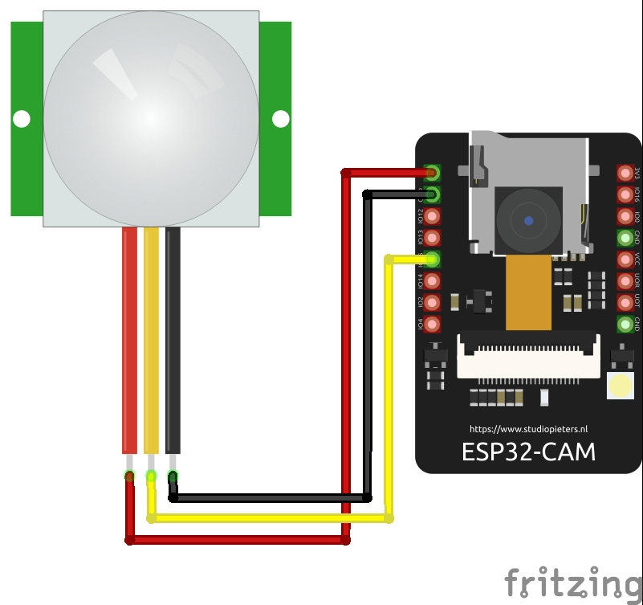

# Discord Spycam
This project uses a ESP32-Cam connected to a motion sensor. When the motion sensor is activated, a photo will be submitted to a desired Discord channel via a webhook.

## Parts needed
- ESP32-Cam
- PIR Motion Sensor

## Programming the ESP-32 Cam
- Using an Arduino

## Installation
1. Connect PIR sensor 
1. Copy arduino_secrets.h.example to arduino_secrets.h
1. Create a Discord certification, using `CertToESP32.py` from [SensorsIot/HTTPS-for-Makers](https://github.com/SensorsIot/HTTPS-for-Makers).
1. Update `arduino_secrets.h` with ssid name, password, certificate from the previous step, and your webhook from Discord.
   - _Note: Be sure to remove the domain from the webhook URL. Reference to the example value._

## Wiring

